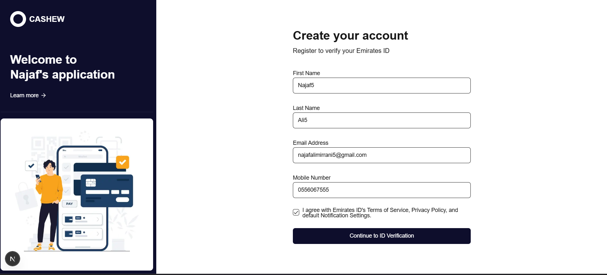
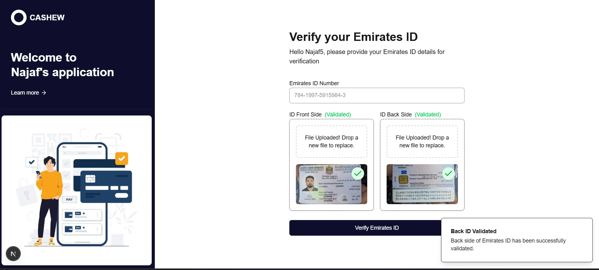
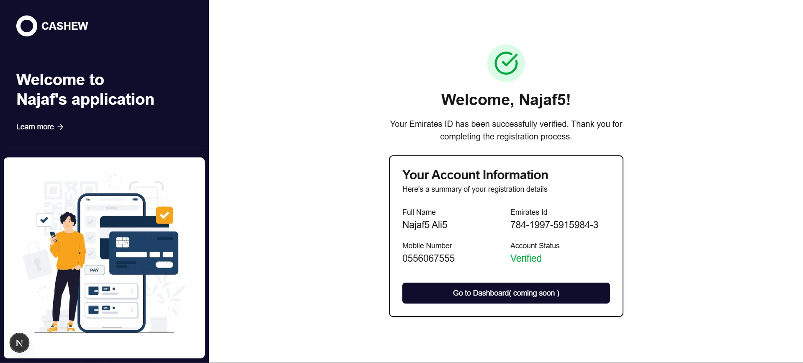

Thought for 3 seconds### Customer Registration & Emirates ID Verification System

## 🚀 Overview

A modern, secure application for user registration with Emirates ID verification. This system provides a seamless registration experience with advanced OCR-based ID verification, ensuring both the front and back sides of Emirates IDs are validated before completing the registration process. The backend repo for this app is https://github.com/Najaf-Mirrani/customer-registration-backend.git. 

## ✨ Features

- **Multi-step Registration Process**

- User information collection
- Emirates ID verification
- Registration completion


- **Advanced ID Verification**

- OCR-powered text extraction from ID cards
- Front and back side validation
- ID number matching with user input
- Keyword detection in both English and Arabic


- **User-Friendly Interface**

- Responsive design for all devices
- Drag-and-drop file uploads
- Real-time validation feedback
- Toast notifications for important events


- **Security Features**

- Client-side validation
- ID authenticity verification
- Pattern matching for Emirates ID format


## 📸 Screenshots
- User information form with validations

- Emirates Id verification

- Registration Complete Screen


## 🛠️ Technologies

- **Frontend Framework**: Next.js 15 with App Router
- **Language**: TypeScript
- **Styling**: Tailwind CSS
- **UI Components**: shadcn/ui
- **OCR Engine**: Tesseract.js
- **File Handling**: react-dropzone
- **Form Validation**: Client-side validation
- **Notifications**: Custom toast system


## 📦 Installation

1. **Clone the repository**


```shellscript
git clone https://github.com/Najaf-Mirrani/customer-registration-frontend.git
cd customer-registration-frontend

```

2. **Install dependencies**


```shellscript
npm install
```

3. **Run the development server**


```shellscript
npm run dev
```

4. **Open your browser**


Navigate to [http://localhost:3000](http://localhost:3000) to see the application.

## 🔧 Usage

### Registration Process

1. **Create Account**

1. Fill in your personal details
2. Accept terms and conditions
3. Click "Continue to ID Verification"


2. **Verify Emirates ID**

1. Enter your Emirates ID number
2. Upload front side of your Emirates ID
3. Click "Validate Front Side"
4. Upload back side of your Emirates ID
5. Click "Validate Back Side"
6. Click "Verify Emirates ID" to complete verification


3. **Complete Registration**

1. Review confirmation page
2. Access your new account


### ID Verification Requirements

- **Front Side Validation**

- Must contain Emirates ID pattern (784-XXXX-XXXXXXX-X)
- ID number must match user input
- Must contain Emirates-related keywords


- **Back Side Validation**

- Must contain signature, expiry date, or related keywords
- Both English and Arabic keywords are recognized


## 📁 Project Structure

```plaintext
customer-registration-frontend/
├── pages/                   # Next.js Pages
│   ├── _app.tsx              
│   ├── layout.tsx           # Root layout
│   └── index.tsx            # Home/registration page
├── components/              # React components
│   ├── layout/              # Layout components
│   │   ├── registration-layout.tsx
│   │   └── sidebar.tsx
│   ├── registration/        # Registration components
│   │   ├── emirates-id-verification.tsx
│   │   ├── registration-complete.tsx
│   │   └── registration-form.tsx
│   ├── ui/                  # UI components (shadcn/ui)
│   └── theme-provider.tsx   # Theme provider
├── hooks/                   # Custom React hooks
│   └── use-toast.ts         # Toast notifications hook
├── lib/                     # Utility functions and types
│   ├── types.ts             # TypeScript types
│   └── utils.ts             # Utility functions
├── public/                  # Static assets
├── tailwind.config.ts       # Tailwind CSS configuration
└── package.json             # Project dependencies
```

## 🤝 Contributing

Contributions are welcome! Please feel free to submit a Pull Request.

1. Fork the repository
2. Create your feature branch (`git checkout -b feature/amazing-feature`)
3. Commit your changes (`git commit -m 'Add some amazing feature'`)
4. Push to the branch (`git push origin feature/amazing-feature`)
5. Open a Pull Request

## 🙏 Acknowledgements

- [Tesseract.js](https://github.com/naptha/tesseract.js) for OCR capabilities
- [shadcn/ui](https://ui.shadcn.com/) for beautiful UI components
- [Next.js](https://nextjs.org/) for the React framework
- [Tailwind CSS](https://tailwindcss.com/) for styling
- [Vercel](https://vercel.com/) for hosting and deployment


---
